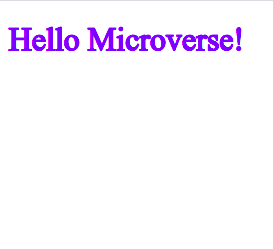

# Set up a "Hello Microverse" project

 This is a simpleproject  to display a "hello Microverse"

## Built With

- HTML
- CSS
- LINTERS FOR HTML/ CSS

## Authors

👤 **AZARIA SAIDI ALLY**

- GitHub: [@azy64](https://github.com/azy64)
- LinkedIn: [LinkedIn](https://www.linkedin.com/in/azaria-saidi-524780112/)

## 🤝 Contributing

Contributions, issues, and feature requests are welcome!

Feel free to check the [issues page](../../issues/).

Give a ⭐️ if you like this project!

## Acknowledgments

- Hat tip to anyone whose code was used
- Inspiration
- etc

## 📝 License

This project is [MIT](./MIT.md) licensed.
